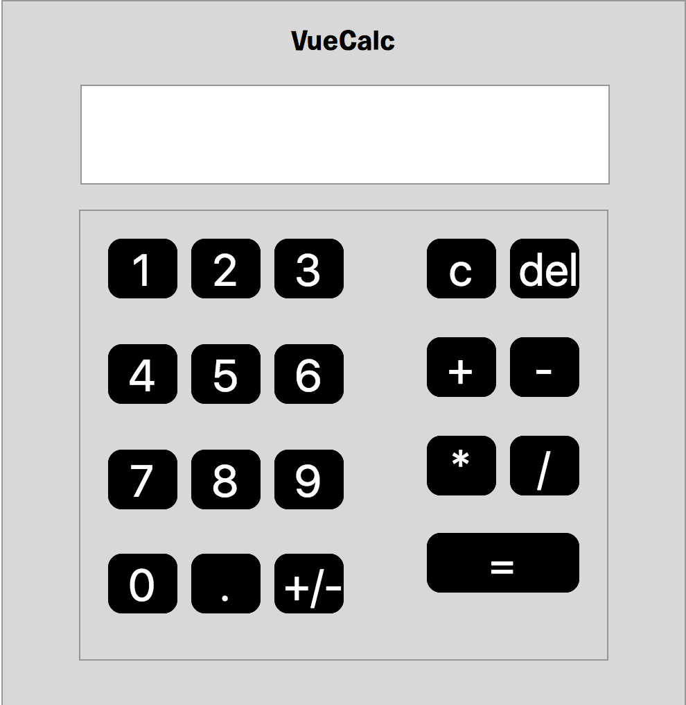

# Vuecalc

A simple calculator with Vue.js.

This simple calculator is just for me to get a view of Vue. ;)

# What does it do?

* Makes very basic calculations for digits.

# What doesn't it do?

* Everything a calculator does that's not very basic. haha!

* Might also be worthy to note that the `.` and `+/-` buttons do nothing @ the moment. I think I got the basic thing I wanted already.

**PS**: The few/many (depending on your perspective) LOC reside in `index.html`.

# Wanna checkout the calculator?

Just `view` the `index.html` file in your browser! Of course, after cloning or downloading.
